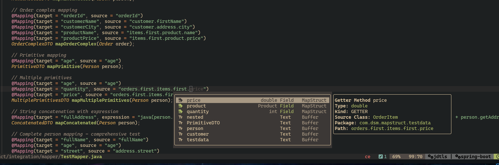
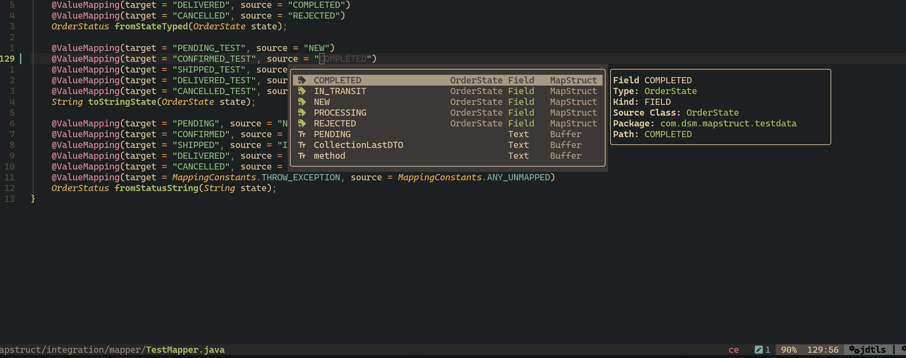

# MapStruct Path Completion Tool

A command-line tool (with IPC support) that provides MapStruct-style path completion using Java reflection. This tool helps to explore nested object paths, navigate through collections, and discover available fields and getters at any point in your object graph. Working as cmd one shoot tool or by IPC (Unix Domain Socket) to long running clients (like NeoVim).

## Why

I love to work with java code as professional java software engineer in NeoVim. As also hard user of intellij in previous, I wanted to have similar mapping helping ability as provided by [Intellij MapStruct Pligin](https://plugins.jetbrains.com/plugin/10036-mapstruct-support)
I have created this tool to use in pair with my neovim config with [blink.cmp](https://github.com/saghen/blink.cmp) completion source.

# Note

This project is under early development state, and I don't know when it will be finished for wide using.

## Features

- Navigate through nested object paths (e.g., `field1.field2.field3`)
- Handle collections and their item accessors (e.g., `items.first`, `list.last`)
- Support for arrays and generic types
- Full support for Java records (accessor methods like `name()`, `age()`)
- Prefix matching for autocomplete suggestions
- JSON output format for easy integration
- Works with any Java class on the classpath
- Be very lightweight

## Requirements

- At least basic `java`, `jvm` and `jdk tools` knowledge
- Java 25 or later
- Maven 3.9.11+ (for building)
  NOTE: for now it's just my personal experiment, without attention to using by somebody else, because of that, I just using latest versions I need and what installed on my machines.

## Building

```bash
cd mapstruct-path-explorer
./mvnw clean package -U -DskipTests
```

This will create two JAR files in the `target/` directory:

- `mapstruct-path-explorer-*.jar` - Regular JAR
- `mapstruct-path-explorer.jar` - Executable (FAT) JAR with all dependencies
- for easy automatic installations [install_explorer script](./install_explorer.sh), it's installing\updating to `$HOME/tools/java-extensions/mapstruct`

## NeoVim integration by blink.cmp

Lua IPC client for neovim, right now it's just part of my nvim configuration, and it's also on very early draft state. it's working, but requiring some work testing, improving and stabilization. In my plans in the future - it's to create separated nvim plugin `blink-cmp-java-mapstruct` with automatic installing\updating server.

### Screenshots of real working in neovim:




## Usage

### Basic Syntax

```bash
java -jar target/mapstruct-path-explorer.jar \
  "<fully.qualified.ClassName>" \
  "<path.expression>"
```

### With Custom Classpath

If you need to analyze classes from your own project:

```bash
java -cp "target/mapstruct-path-explorer.jar:/path/to/your/classes" \
  com.dsm.mapstruct.MapStructPathTool \
  "com.example.User" \
  "address.street"
```

## Examples

### 1. Show All Fields in a Class

```bash
java -jar mapstruct-path-explorer.jar "com.example.User" ""
```

**Output:**

```json
{
  "className": "com.example.User",
  "simpleName": "User",
  "packageName": "com.example",
  "path": "",
  "completions": [
    { "name": "address", "type": "Address", "kind": "FIELD" },
    { "name": "address", "type": "Address", "kind": "GETTER" },
    { "name": "age", "type": "int", "kind": "FIELD" },
    { "name": "age", "type": "int", "kind": "GETTER" },
    { "name": "email", "type": "String", "kind": "FIELD" },
    { "name": "email", "type": "String", "kind": "GETTER" },
    { "name": "firstName", "type": "String", "kind": "FIELD" },
    { "name": "firstName", "type": "String", "kind": "GETTER" }
  ]
}
```

**Note**: Getter names are transformed to MapStruct property format:

- `getFirstName()` → `firstName`
- `isActive()` → `active`

### 2. Navigate to Nested Field

```bash
java -jar mapstruct-path-explorer.jar "com.example.User" "address."
```

**Output:**

```json
{
  "className": "com.example.Address",
  "simpleName": "Address",
  "packageName": "com.example",
  "path": "address.",
  "completions": [
    { "name": "city", "type": "String", "kind": "FIELD" },
    { "name": "country", "type": "Country", "kind": "FIELD" },
    { "name": "state", "type": "String", "kind": "FIELD" },
    { "name": "street", "type": "String", "kind": "FIELD" },
    { "name": "zipCode", "type": "String", "kind": "FIELD" }
  ]
}
```

### 3. Filter by Prefix

```bash
java -jar mapstruct-path-explorer.jar "com.example.User" "address.st"
```

**Output:**

```json
{
  "className": "com.example.Address",
  "simpleName": "Address",
  "packageName": "com.example",
  "path": "address.st",
  "completions": [
    { "name": "state", "type": "String", "kind": "FIELD" },
    { "name": "street", "type": "String", "kind": "FIELD" }
  ]
}
```

### 4. Navigate Through Collections

MapStruct uses property-style syntax for collections:

```bash
java -jar mapstruct-path-explorer.jar "com.example.Order" "items.first."
```

**Output:**

```json
{
  "className": "com.example.OrderItem",
  "simpleName": "OrderItem",
  "packageName": "com.example",
  "path": "items.first.",
  "completions": [
    { "name": "price", "type": "double", "kind": "FIELD" },
    { "name": "product", "type": "Product", "kind": "FIELD" },
    { "name": "quantity", "type": "int", "kind": "FIELD" }
  ]
}
```

### 5. Deep Nested Navigation

```bash
java -jar mapstruct-path-explorer.jar "com.example.Order" "items.first.product.name"
```

**Output:**

```json
{
  "className": "com.example.Product",
  "simpleName": "Product",
  "packageName": "com.example",
  "path": "items.first.product.name",
  "completions": [{ "name": "name", "type": "String", "kind": "FIELD" }]
}
```

### 6. Navigate Through Java Records

Java records are fully supported. Record component accessor methods (like `name()`, `age()`) are treated as getters:

```bash
java -jar mapstruct-path-explorer.jar "com.example.PersonRecord" ""
```

**Output:**

```json
{
  "className": "com.example.PersonRecord",
  "simpleName": "PersonRecord",
  "packageName": "com.example",
  "path": "",
  "completions": [
    { "name": "firstName", "type": "String", "kind": "GETTER" },
    { "name": "lastName", "type": "String", "kind": "GETTER" },
    { "name": "age", "type": "int", "kind": "GETTER" }
  ]
}
```

**Nested Records:**

```bash
java -jar mapstruct-path-explorer.jar "com.example.AddressRecord" "country."
```

**Output:**

```json
{
  "className": "com.example.CountryRecord",
  "simpleName": "CountryRecord",
  "packageName": "com.example",
  "path": "country.",
  "completions": [
    { "name": "name", "type": "String", "kind": "GETTER" },
    { "name": "code", "type": "String", "kind": "GETTER" }
  ]
}
```

### 7. Terminal Types (Primitives and String)

When navigating to primitive types, wrapper types, or String, the tool returns empty completions since these types don't have meaningful MapStruct properties:

```bash
java -jar mapstruct-path-explorer.jar "com.example.Person" "firstName."
```

**Output:**

```json
{
  "className": "java.lang.String",
  "simpleName": "String",
  "packageName": "java.lang",
  "path": "firstName.",
  "completions": []
}
```

This applies to all terminal types:

- Primitives: `int`, `long`, `double`, `float`, `boolean`, `byte`, `short`, `char`
- Wrapper types: `Integer`, `Long`, `Double`, `Float`, `Boolean`, `Byte`, `Short`, `Character`
- String: `java.lang.String`

## Supported Path Expressions

### Field Access

- `field1` - Access a field
- `field1.field2` - Navigate through nested fields
- `field1.field2.field3` - Multiple levels deep

### Method Calls

- `getFirst()` - Call a no-arg method
- `getAddress().getCity()` - Chain method calls

### Collection Navigation

MapStruct uses **property-style syntax** for collection accessors:

- `orders.first` - Access first element (not `orders.getFirst()`)
- `orders.last` - Access last element (not `orders.getLast()`)
- `items.empty` - Check if empty

**Important**: MapStruct does NOT support method call syntax like `getFirst()`. Always use property-style:

- ✅ Correct: `orders.first.customer.name`
- ❌ Wrong: `orders.getFirst().customer.name`

SequencedCollection<> implementations (like Lists) supporting `first` and `last` properties.

### Prefix Matching

- `address.str` - Shows all fields starting with "str" (case-insensitive)
- `address.` - Shows all fields (empty prefix)

## How It Works

1. **Path Parsing**: Parses the MapStruct path expression into segments
2. **Reflection Analysis**: Uses Java reflection to analyze class structure
3. **Type Resolution**: Resolves generic types in collections (e.g., `List<Person>` → `Person`)
4. **Navigation**: Follows the path through the object graph
5. **Completion**: Returns available fields/getters at the final location
6. **Filtering**: Applies prefix matching if a partial segment is provided

## Architecture

```
MapStructPathTool (Main)
    │
    └─> PathNavigator
            ├─> PathParser
            │   └─> Parses path expressions
            │
            ├─> ReflectionAnalyzer
            │   └─> Extracts public fields and getters
            │
            ├─> CollectionTypeResolver
            │   └─> Resolves generic types
            │
            └─> NameMatcher
                └─> Filters by prefix
```

## Testing

Run the unit tests:

```bash
./mvnw test
```

The test suite includes:

- PathParser tests - path expression parsing
- ReflectionAnalyzer tests - class introspection (including Java records)
- PathNavigator tests - end-to-end integration tests (including record navigation)
- MapStructPathTool tests - main method and CLI functionality

## Integration with IDEs

This tool can be integrated with IDE plugins to provide MapStruct path completion. Example integration:

1. IDE plugin calls the tool with current class and partial path
2. Tool returns JSON with completion suggestions
3. Plugin displays suggestions to user

## Limitations

- Only works with compiled classes on the classpath
- Requires Java 17 for `getFirst()`/`getLast()` support on collections and record support
- Method parameters in paths are ignored (e.g., `get(0)` treats 0 as placeholder)
- Raw collection types return `Object` as item type
- Does not support complex generic type scenarios (e.g., nested generics)
- Only returns public members (fields and getters) as MapStruct can only access public members
- Returns empty completions for terminal types (primitives, wrapper types like Integer, and String) as they have no useful MapStruct properties to navigate to

## Troubleshooting

### Class Not Found Error

**Problem**: `ClassNotFoundException` when running the tool

**Solution**: Add your classes to the classpath:

```bash
java -cp "mapstruct-path-explorer.jar:your-classes.jar:another-dependency.jar" \
  com.dsm.mapstruct.MapStructPathTool \
  "com.your.Class" "path"
```

### Empty Completions

**Problem**: Tool returns empty completions

**Possible causes**:

- Invalid path (field/method doesn't exist)
- Class doesn't have any accessible fields or getters
- Incorrect class name

**Solution**: Verify the path step by step:

```bash
# Start from root
java -jar tool.jar "com.example.User" ""

# Then navigate deeper
java -jar tool.jar "com.example.User" "address."
```

### Java Version Issues

**Problem**: `UnsupportedClassVersionError`

**Solution**: Ensure you're using Java 25 or later:

```bash
java -version
```

## Status

- [x] Implement core mapstruct path exploring functionality;
- [x] Covering all by unit tests with using mapstruct real mappers, and make init stabilization work;
- [x] Implement basic one shot runner from cmd (acceptable only for testing or not hard using (because of long class path usually, and it will have starting performance penalty because of that);
- [x] Implement lightweight IPC by using Uxin Domain Socket for communication by long running applications like NeoVim;
- [ ] Testing and stabilization work.
